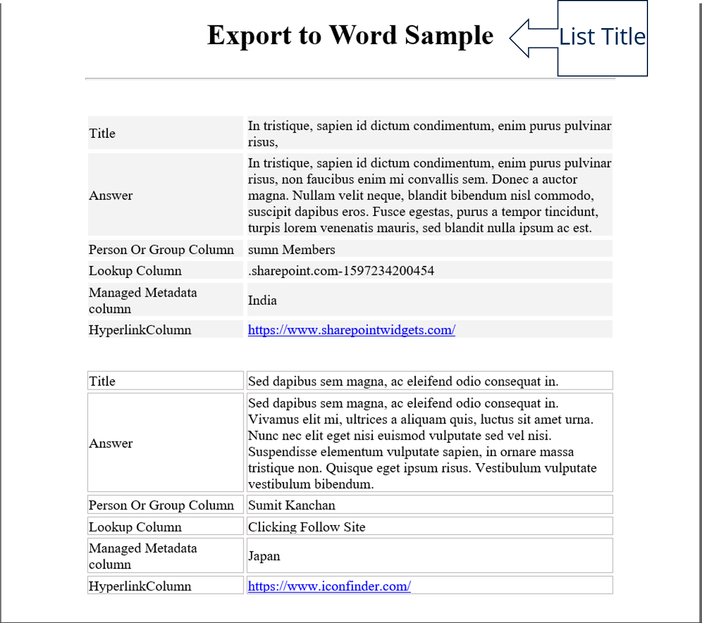

# Export SharePoint List to MS Word
----
[](https://www.sharepointwidgets.com/)


This is the SharePoint Framework List Command set, which exports the list items to the word document. Export either all the items in the list or choose the ones you want to export and it will export only those items. Export will include the columns that are corresponding to the currently selected view, so create a view with the columns required and hit __"EXPORT TO WORD"__ in the list view command set.


### Features..!!
- Exports the items list into the MS Word with beautiful formatting
- Option to export only the selected items
- Export the items based on the current view fields
- If the view contains exactly two columns with title `"Title"` & `"Answer"`, it exports the items into the QnA format
- No configurtion needed
- Supports all fields formats

### Demo - How it works..??


### Exported Word file Sample



### Building the code

```bash
git clone the repo
npm install
npm bundle --ship
npm package-solution --ship
```
Deploy it to the app acataloge and install the app to the site want to active the feature.

### Limitation

- Currently supports only single values of field types no multi values support


### TODO

- Export items based on the view filters
- Export items based on the view sorting


### About

| Version | Date        | Author        |
|---------|-------------|---------------|
| 1.0.0.0 | 14 Aug 2020 | Sumit Kanchan |

## Disclaimer

THIS CODE IS PROVIDED AS IS WITHOUT WARRANTY OF ANY KIND, EITHER EXPRESS OR IMPLIED, INCLUDING ANY IMPLIED WARRANTIES OF FITNESS FOR A PARTICULAR PURPOSE, MERCHANTABILITY, OR NON-INFRINGEMENT.
